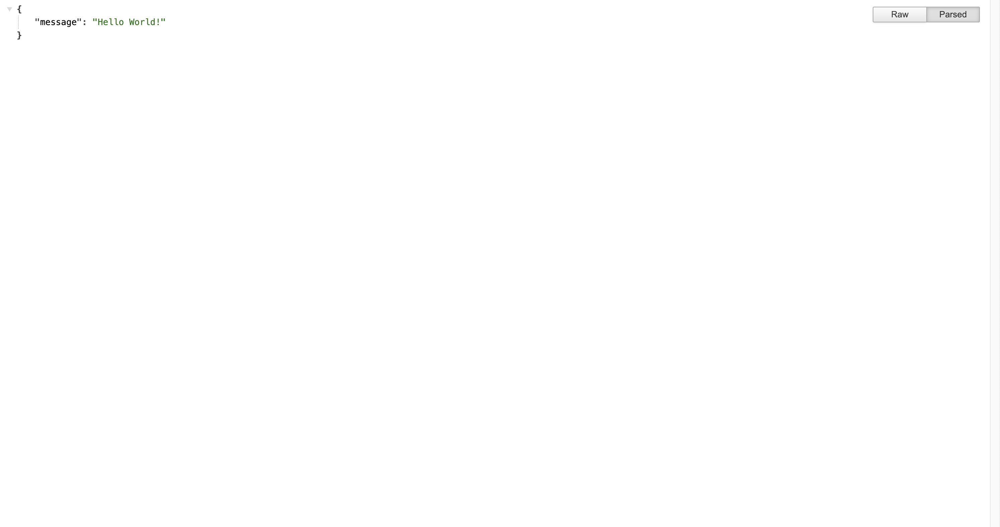
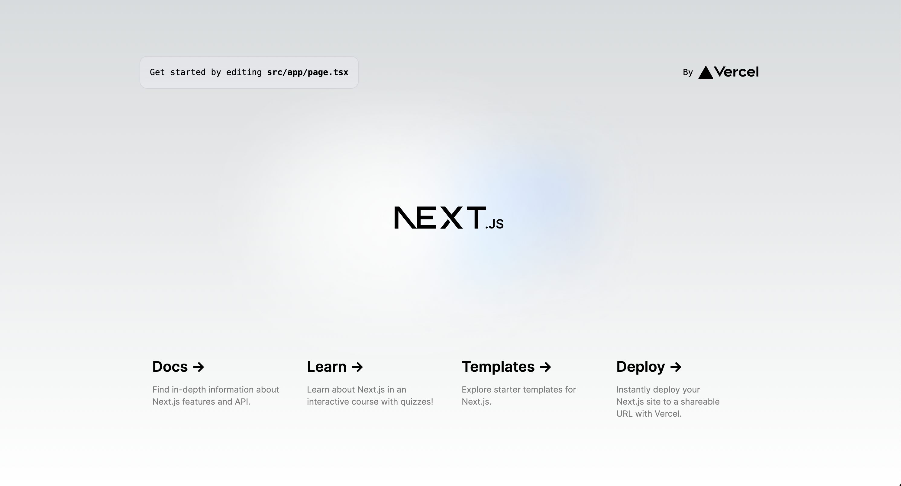
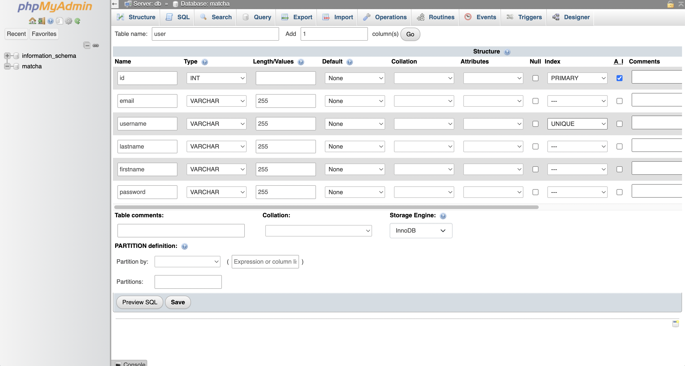
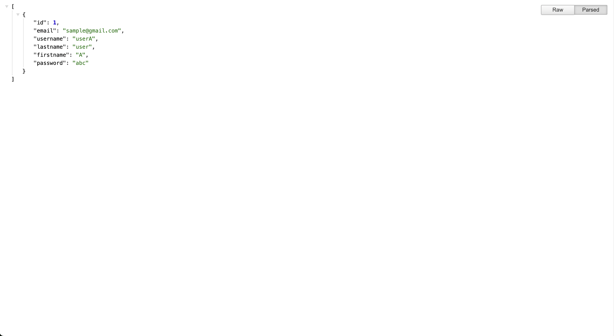
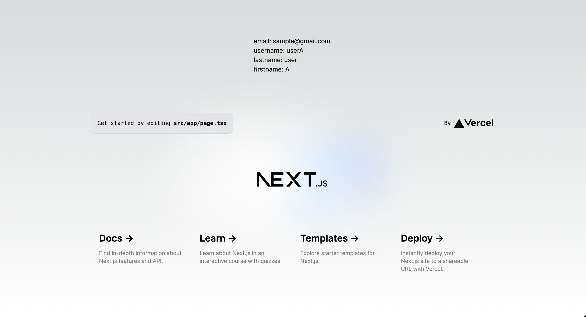
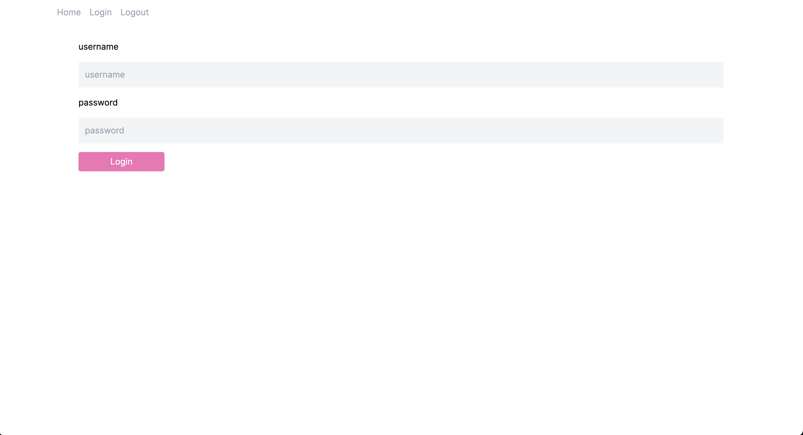

# matcha
## ゴール
42Parisのセカンドサークルの課題matchaに取り組みました。
マッチングアプリを作成する課題になります。
利用する技術は、自分で決められるので、今回は下記を利用しました。
- プロキシサーバー: nginx
- フロントエンド: Next.js(React)
- バックエンド: Express(Node.js)
- DB: mariadb

## やってみた結果


## 開発環境
- macOS
- VidualStudioCode

## 事前準備
- nodeとnpmがインストール済みで有ることを確認しました。
```
% node -v
v18.17.0
% npm -v
9.6.7
```

## やったこと
- クライアント側のプロジェクト作成
- サーバー側のプロジェクト作成
- Dockerコンテナ化する
- DBの追加
- プロキシサーバーの追加
- プロキシサーバー → クライアント側 → サーバー側 → DBの接続確立
- ユーザー認証機能の作成
- ユーザー情報表示機能の作成

## クライアント側のプロジェクト作成
Next.js(React)のプロジェクトを作成しました。
```
% npx create-next-app@latest
✔ What is your project named? … client
✔ Would you like to use TypeScript? … Yes
✔ Would you like to use ESLint? … Yes
✔ Would you like to use Tailwind CSS? … Yes
✔ Would you like to use `src/` directory? … Yes
✔ Would you like to use App Router? (recommended) … Yes
✔ Would you like to customize the default import alias (@/*)? … No
```

## サーバー側のプロジェクト作成
Express(Node.js)のプロジェクトを作成しました。
package.jsonに追記して、修正時に即座にコンパイルされるように、開発モードの起動方法を指定しました。
また、アプリ起動時に走るindex.jsで、Expressアプリを起動するよう記載しました。
```
% mkdir server
% cd server
% npm init
package name: (matcha_re) server
version: (1.0.0) 
description: 
entry point: (index.js) 
test command: 
git repository: 
keywords: 
author: 
license: (ISC) 
% npm i express
% npm i nodemon --save-dev
% vi package.json
  "scripts": {
    "test": "echo \"Error: no test specified\" && exit 1",
    "start": "node index.js",
    "dev": "nodemon index.js"
  },
% vi index.js
const express = require('express');
const app = express();
const PORT = 4000;

app.get('/api/hello', (req, res) => {
    res.json({ message: 'Hello World!' });
})

app.listen(PORT, () => {
    console.log(`Server listening at http://localhost:${PORT}`);
})
```

## Dockerコンテナ化する
アプリを起動する為のDockerfileを[client側](https://github.com/Lala-pukuchan/matcha/blob/main/client/Dockerfile)、[server](https://github.com/Lala-pukuchan/matcha/blob/main/server/Dockerfile)側それぞれに作成しました。
ルートディレクトリのdocker-compose.ymlから、それらを使ってイメージを作成するように指定しました。
```
docker compose up --build
```
[クライアント側](http://localhost:3000/)に接続すると、画面の表示が確認できました。

[サーバー側](http://localhost:4000/)に接続すると、jsonデータの表示が確認できました。


## DBの追加
docker-compose.ymlを修正して、mariadbを追加しました。
また、phpMyAdminを追加して、DBの内容をブラウザから確認できるようにしました。

## プロキシサーバーの追加
docker-compose.ymlを修正して、nginxを追加しました。

## プロキシサーバー → クライアント側 → サーバー側 → DBの接続確立
nginxの設定ファイル(default.conf)を修正して、アクセス時にクライアント側へリダイレクトする形にしました。
```
    location / {
        proxy_pass http://front:3000;
        proxy_set_header Host $host;
        proxy_set_header X-Real-IP $remote_addr;
        proxy_set_header X-Forwarded-For $proxy_add_x_forwarded_for;
        proxy_set_header X-Forwarded-Proto $scheme;
    }
```
[ブラウザ](http://localhost)に接続すると、画面の表示が確認できました。


[ブラウザ](http://localhost:2306/)から、phpMyAdminに接続して、DB内にuserテーブルを作成し、テストデータを挿入します。


サーバー側のコンテナに入り、mariadb接続用のコネクターをインストールします。
index.jsを修正して、サーバー側にDBからユーザー情報を取得して返却するAPIを作成します。
```
docker exec -it <container id of server app> sh
/app # npm install mariadb
/app # exit

vi index.js
const mariadb = require("mariadb");
const pool = mariadb.createPool({
  host: process.env.DB_HOST,
  user: process.env.DB_USER,
  password: process.env.DB_PASS,
  database: process.env.DB_NAME,
  connectionLimit: 5,
});
app.get("/api/users/", async (req, res) => {
    let conn;
    try {
        conn = await pool.getConnection();
        const rows = await conn.query("SELECT * FROM user");
        return res.json(rows)
    } catch (e) {
        console.log(e);
        return res.status(500).json({ message: "Internal server error" });
    } finally {
        if (conn) return conn.end();
    }
});
```
[サーバー側](http://localhost:4000/api/users/)に接続すると、jsonデータの表示が確認できました。


クライアント側からのAPI呼び出しを許可するCORS設定をサーバー側に入れます。
```
docker exec -it <container id of server app> sh
/app # npm install cors
/app # exit

vi index.js
const cors = require('cors');
app.use(cors());
```
クライアント側から、サーバー側へAPI呼び出しを行い、その内容を画面に表示します。
```
"use client";
import { useState, useEffect } from "react";
import Image from "next/image";

export default function Home() {
  const [users, setUsers] = useState([]);
  useEffect(() => {
    fetch(`${process.env.NEXT_PUBLIC_API_URL}/api/users`)
      .then((res) => {
        return res.json();
      })
      .then((data) => setUsers(data))
      .catch((err) => console.log(err));
  }, []);
  return (
    <main className="flex min-h-screen flex-col items-center justify-between p-24">
      {users.length > 0 ? (
        <div>
          {users.map((user, index) => (
            <div key={user.id || index}>
              <p>email: {user.email}</p>
              <p>username: {user.username}</p>
              <p>lastname: {user.lastname}</p>
              <p>firstname: {user.firstname}</p>
            </div>
          ))}
        </div>
      ) : (
        <p>No users found.</p>
      )}
```
[ブラウザ](http://localhost)に接続すると、ユーザー情報の表示が確認できました。


## ユーザー認証機能の作成
- サーバー側で、ユーザー登録API（/api/user）を作成します。
  - bcryptを利用して、パスワードをハッシュ化します。
    ```
    const salt = await bcrypt.genSalt(10);
    const hashedPassword = await bcrypt.hash(password, salt);
    ```
  - POSTされたユーザーデータをDBに挿入します。
  - ユーザー有効化用メールは、Nodemailerを利用してgmailを送信しました。
  - ユーザー有効化用リンクには、パラメーターにjwtを付加することで、ユーザー情報の受け渡しが出来るようにしました。
- サーバー側で、ログインAPI（/api/login）を作成します。
  - ユーザー名とパスワードが合致するユーザーをDBで検索します。
  - 存在した場合は、ユーザー情報からjwtトークンを生成し、HTTPレスポンスのCookieに追加します。
    ```
    const token = jwt.sign(user, process.env.JWT_SECRET);
    res.cookie("jwt", token, {
      httpOnly: true,
      maxAge: 24 * 60 * 60 * 1000,
    });
    ```
- CORSの設定をフロント側とCookieのやりとりが出来るように修正します。
  ```
  app.use(cors({ credentials: true, origin: "http://localhost:1080" }));
  ```
- サーバー側に、cookie-parserをインストールして、APIリクエストが来た際に、cookieの中に格納されているJWTを確認することが出来るようにします。
  ```
  const token = req.cookies.jwt;
  const claims = jwt.verify(token, process.env.JWT_SECRET);
  ```
- サーバー側で、ログアウトAPI（/api/logout）を作成します。
  - cookieに設定済みのjwtを削除します。
  ```
  res.clearCookie("jwt");
  ```
- クライアント側で、各APIを呼び出すGUIを作成します。
  - 
- クライアント側で、cookieの中に格納されているJWTを取得し、全ページでユーザー情報を共有します。
  - UserContextを利用し、RootLayout内に差し込むことで、Cookieのjwtに内包されたユーザー情報を一度のみ取得し、全ページで共有させます。

## ユーザー情報表示機能の作成


## 参考文献
[Expressから、MariaDBへの接続方法](https://mariadb.com/kb/en/getting-started-with-the-nodejs-connector/)
[ExpressでのJWT認証の実装方法](https://www.youtube.com/playlist?list=PLlameCF3cMEs0NQhLQtTdbL1VEfD1tK7Y)
[Gmail送信方法](https://medium.com/@y.mehnati_49486/how-to-send-an-email-from-your-gmail-account-with-nodemailer-837bf09a7628)
[Contextの実装方法](https://episyche.com/blog/how-to-use-context-api-in-a-nextjs-app)

## 補足
- 課題要件で、ORMが使えませんでした。クラスを作成することも考えましたが、冗長だったので、API内にSQLを記載しています。

